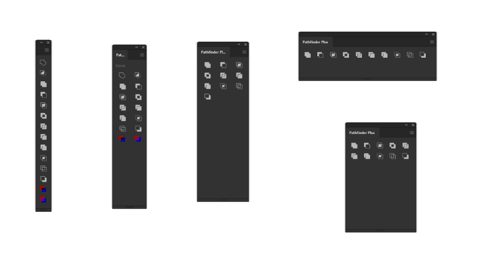
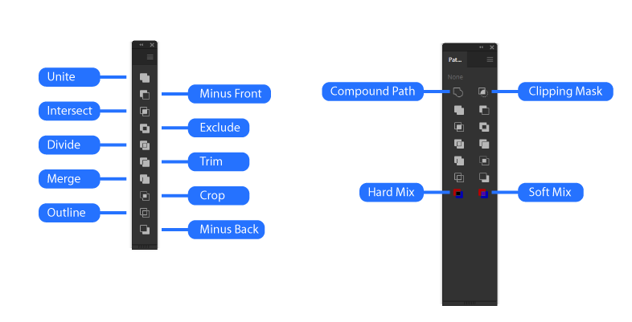

# Pathfinder Plus

Rebuild of Pathfinder panel to add responsive UI and additional features

## Installation and use

- [Download the ZXP by clicking here](https://github.com/Inventsable/Pathfinder-Plus/raw/master/archive/Pathfinder-Plus_1.0.1.zxp)
- Use a valid ZXP installer (like [ZXPInstaller](https://zxpinstaller.com/) or [Anastasiy's Extension Manager](https://install.anastasiy.com/)) and open the ZXP
- Relaunch Illustrator and find in Windows > Extensions > Pathfinder Plus

---

## Features

### Fully responsive UI flexes and rearranges itself depending on panel size

### All basic Pathfinder operations including Compound Path, Clipping Mask, Hard and Soft Mix:

---

## Context Menu

- `Show Annotation` - Displays the name of the operation as you hover over buttons
- `Responsive UI` - Buttons will become disabled unless at least two objects are selected
- `Extra Functions` - Adds Compound Path, Clipping Mask, Hard Mix and Soft Mix
- `Retain Selection` - Combs through the document after each operation to ensure result is still selected, adds additional overhead that might make the panel slower on very large documents
- ~~`Live Preview`~~ - Was going to include a live preview of the result as you hover over each operation but this isn't straightforward to solve with user data and SVG/CSS
- `Refresh Panel` - Reloads the extension
- `Copy debug URL` - Copies localhost URL of panel debugging port to clipboard which can access Chrome DevTools on the extension via the [CEFClient program found here](https://github.com/Adobe-CEP/CEP-Resources/tree/master/CEP_9.x)
